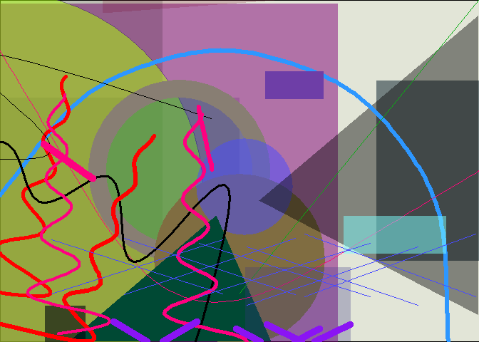

<!-- README.md is generated from README.Rmd. Please edit that file -->
Install:

``` r
devtools::install_github("gsimchoni/kandinsky")
```

Load:

``` r
library(kandinsky)
```

Generate a random Kandinsky painting:

``` r
kandinsky()
```


Generate a Kandinsky Painting from the `mtcars` dataset:

``` r
kandinsky(mtcars)
```



More information [here](http://giorasimchoni.com/2017/07/30/2017-07-30-data-paintings-the-kandinsky-package/).
